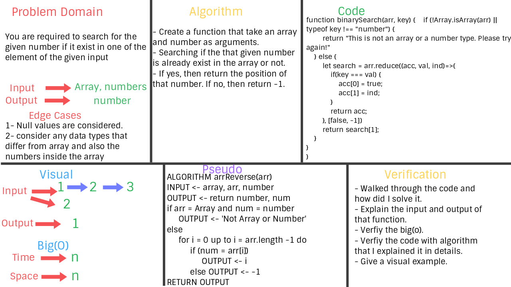

# Challenge Summary
**The idea of earching an item within an array**

## Challenge Description
**A function that search an input number and walk through the elements of the given array if they were the same number. If yes, then return the index of that number inside the array. If no, return -1.**

## Approach & Efficiency
**Big (O) -> n**

## Solution
