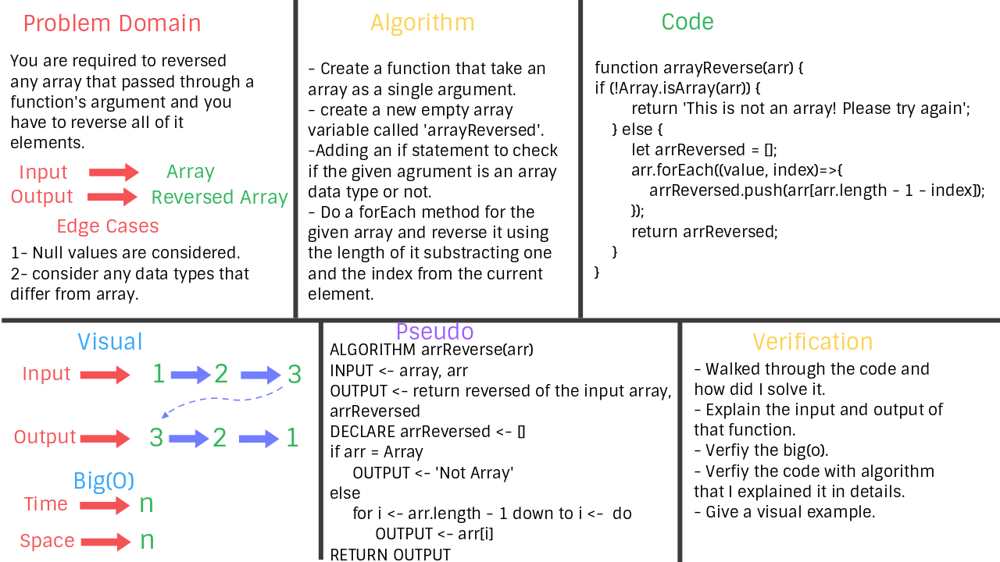

# Reverse an Array
**Reversed any array's argument.**

## Challenge
**Taking an array as an argument for a function called 'arrReverse' and return a reversed elements of this array.**

## Approach & Efficiency
**I used forEach method inside the function of the input array, declaring a new empty array. So the sapce will be (n) and then starting from the last element of the input array and pushing it into the new output array.**
***Checkout the figure below to undertand what I exactly did for the solution of this problem.***

## Solution
