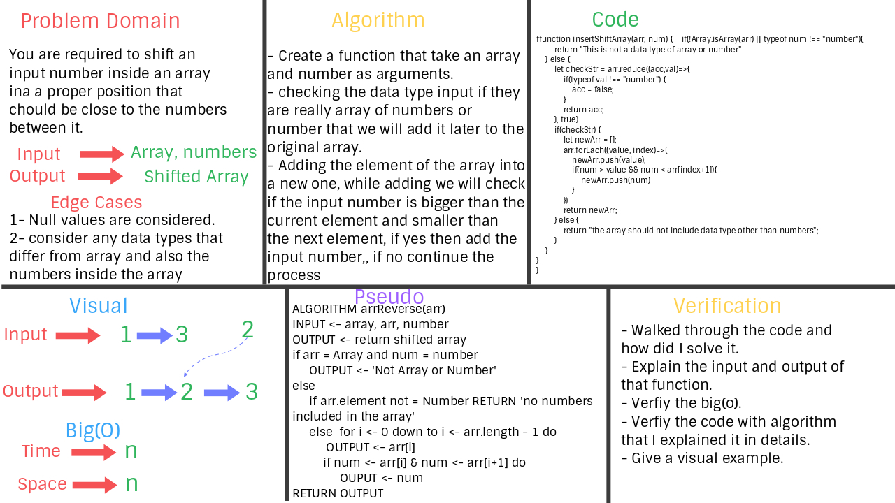

# Challenge Summary
**Inserting a number inside an array.**

## Challenge Description
**The whole Idea of this function is to get a two arguments, which they are an array of numbers and number. Inserting this number in a proper position that will be between two number that are closer to it whether upward or downward.**

## Approach & Efficiency
**Checking if the array and the number inputs are the same datatype, and also checking if the array include something other than a number.**
***Big(o) -> n***

## Solution
