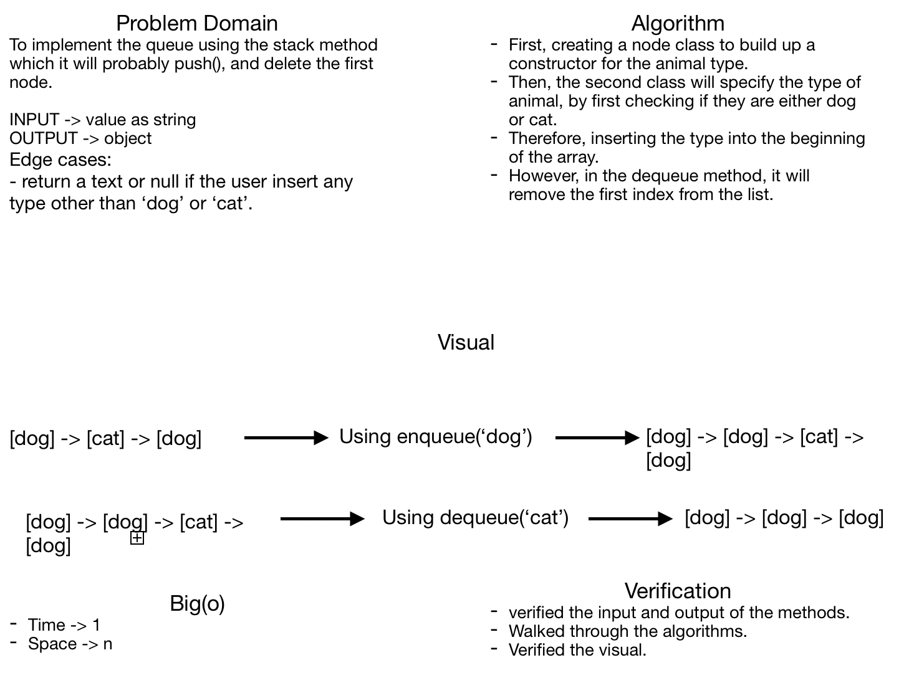

# Challenge Summary
**First-in, First out Animal Shelter.**

## Challenge Description
**Applying the conecpt of first in and first out in both objects (dog and cat) and if the user insert any other types, the method whether dequeue or enqueue will return null or warn message.**

## Approach & Efficiency
- enqueue
**Big(o) -> Time -> o(1)**
**Big(o) -> Space -> o(n)**

- dequeue
**Big(o) -> Time -> o(1)**
**Big(o) -> Space -> o(1)**

## Solution

