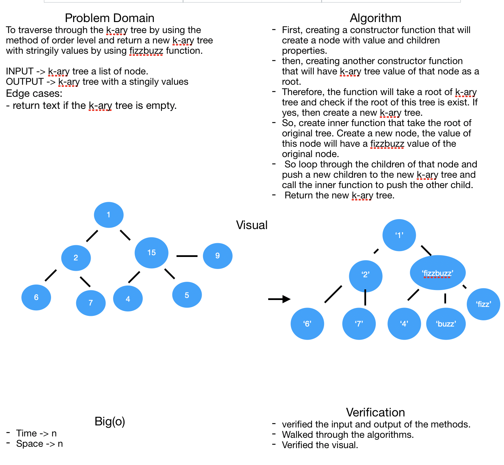

# Challenge Summary
**Creating new K-ary Tree by FizzBuzz**

## Challenge Description
**Creating a new k-ary tree with values that got from the fizbuzz funtion which return fizzbuzz if the number is dividable by 3 and 5, fizz if the number is dividable by 3, buzz if the number is dividable by 5, the string of the number if not dividable by both of them.**

## Approach & Efficiency
**Big(o) -> Time -> n**
**Big(o) -> Space -> n**

## Solution
