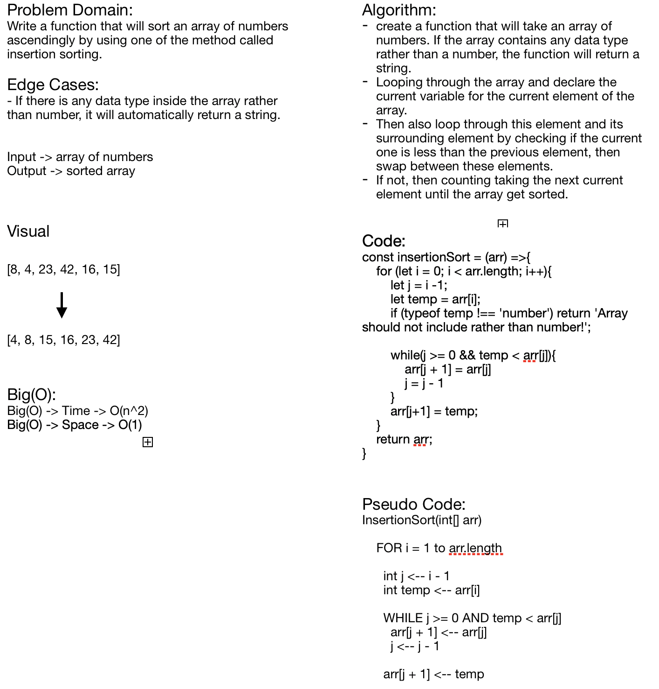

# Challenge Summary
**Insertion Sorting**

## Challenge Description
**Sorting an array of numbers by looping through the array and also get the curret element of that array if the current is less than the previous one. Then, swap these element if not just continue assigning to the next element.**

## Approach & Efficiency
**Big(O) -> Time -> O(n^2)**
**Big(O) -> Space -> O(1)**

## Solution
