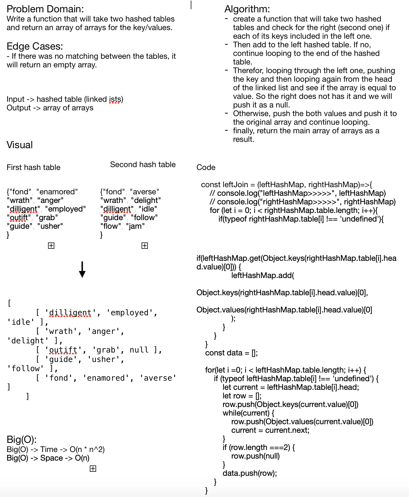

# Hashmap LEFT JOIN
**Hashmap Left Join to ckeck if the key available and has values in both hash tables.**

## Challenge
**Hashmap will take two hashed tables and check if they both share the same key if yes, then return this key and its values from both hased table.**

## Approach & Efficiency
**Big(O) -> Time -> 0(n * n^2)**
**Big(O) -> Space -> 0(n)**

## Solution
