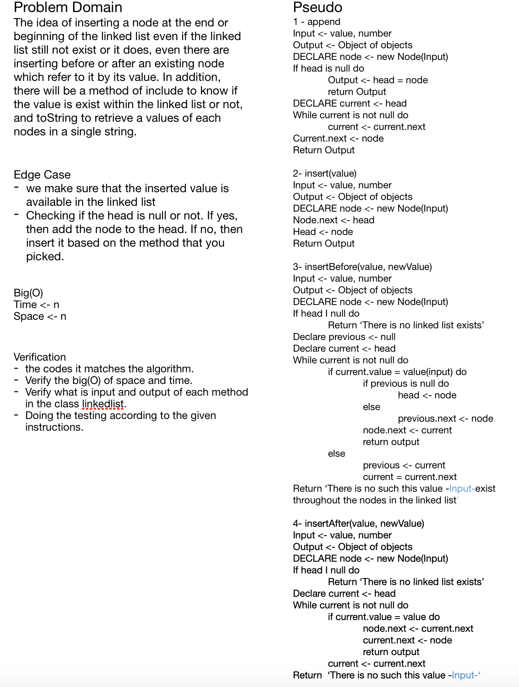
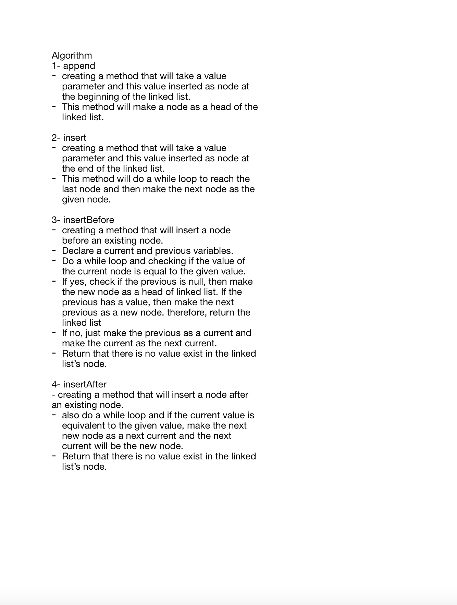

# Singly Linked List
**Creating a singly linked list.**

## Challenge
**Creating a singly linked list by inserting a each node by the user a using a constructor classes to build up these nodes inside the linked list. Also, creating methods that can let you insert a node whether end, beginning, before an existing node or after an existing node.**

## Approach & Efficiency
***I used 'while' looping in order to retrieve throughout the constructed linkedlist.***
***Big(O) -> Time -> n -> We made a while loop inside each method***
***Big(O) -> Space -> n -> Because we create an object variables inside each methods***

## API
- **insert(value)**
This method will let the user to insert the value of node at the beginning of the linked list and this one will be inserted at the end and the user can do a chaining of insert methods.

- **includes(value)**
This method will return a boolean value to do a checking for the user if this certain value is exist in the linked list or not.

- **toString()**
This method will return a string of all values of linked list once its invoked.

- **append(value)**
This method will insert a node at the end of linked list. Also you can do a chaining of appending methods.

- **insertBefore(value, newVal)**
This method is aimed to insert a node before a node that has a given value which as you can see from the second argument of this method. If the head was null then insert the node as a head.

- **insertAfter(value, newVal)**
This method is aimed to insert a node after a node that has a given value which as you can see from the second argument of this method. If the head was null then insert the node as a head.

### Whiteboard (Solution)

