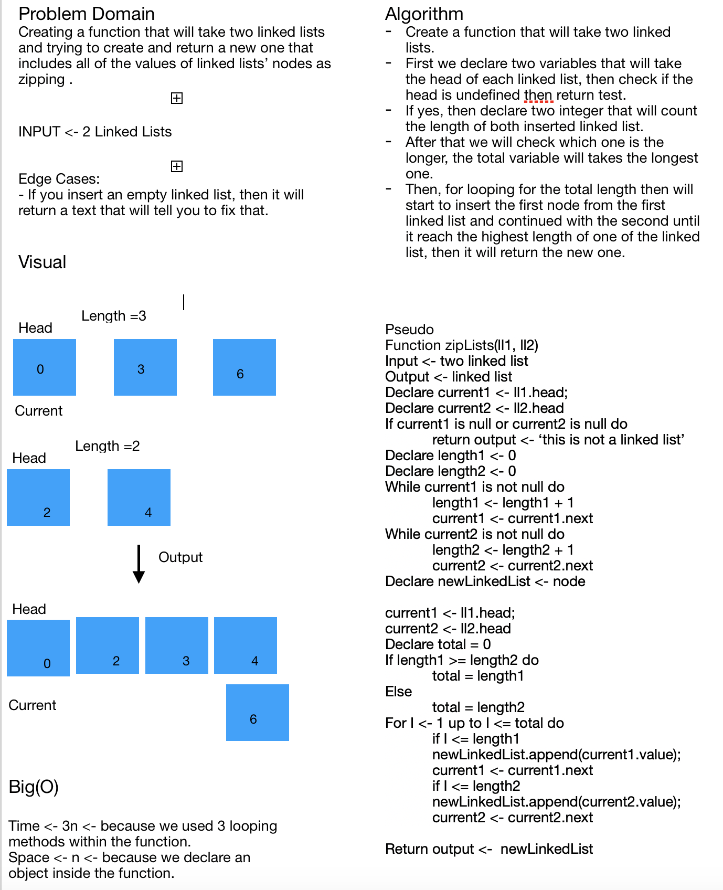

# Challenge Summary
**Zipping a two linked list into one linked list**

## Challenge Description
**In this challenge, we will create a new linked list that will get each node's value and inserted into the new linked list.**

## Approach & Efficiency
***Big(O) -> Time -> 3n -> We made a three looping methods only inside the function zipLists***
***Big(O) -> Space -> n -> Because we create an object variables inside each methods***

## Solution

