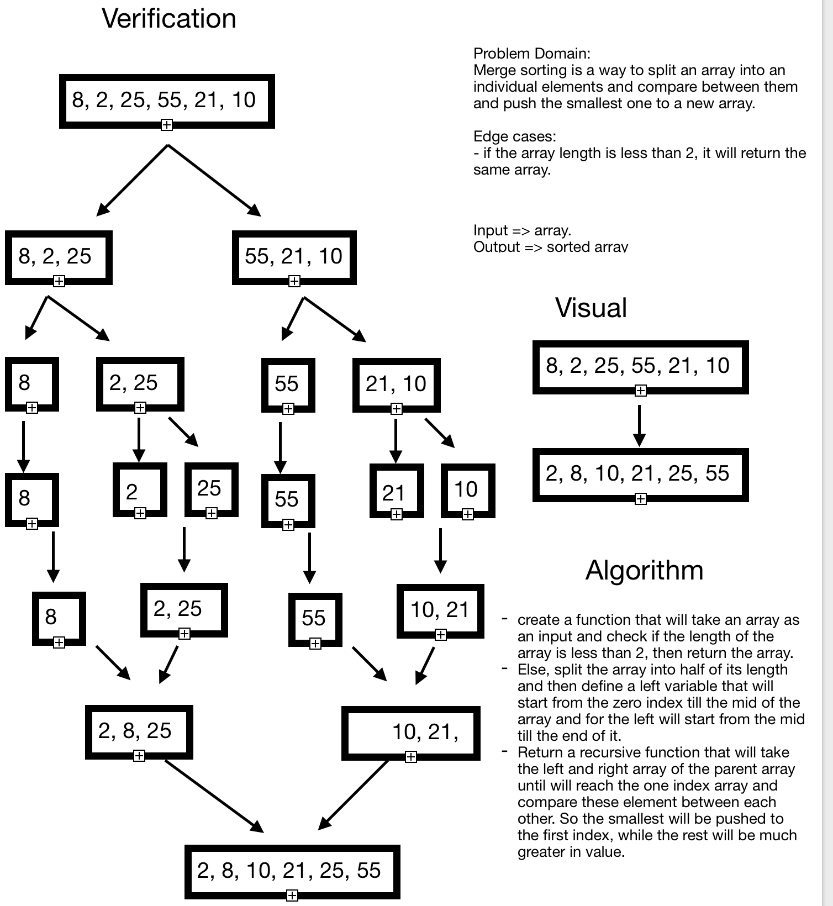

# Challenge Summary
**Merge Sorting**

## Challenge Description
**Using a recursive function by separating an array into half and keep separating until the length will be one and compare these values by swaping them ascendingly.**

## Approach & Efficiency
**Big(O) -> Time -> O(n^2)**
**Big(O) -> Space -> O(1)**

## Solution
