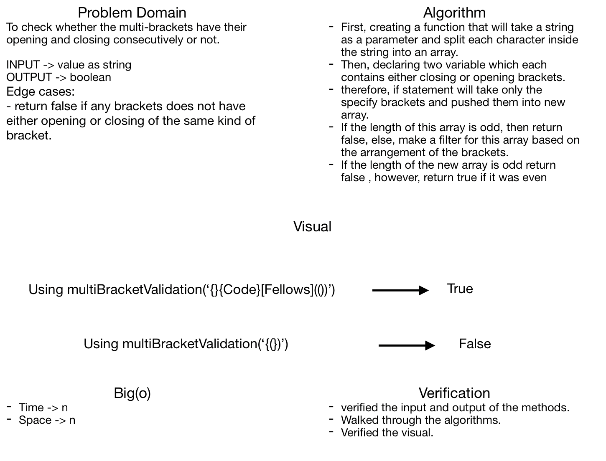

# Challenge Summary
**Checking a multi-brackets validation.**

## Challenge Description
**The idea of this functio is that will take a string as a parameter and return boolean value based on the brackets where they are consecutives and each one does have their opening and closing.**

## Approach & Efficiency
**Big(o) -> Time -> n**
**Big(o) -> Space -> n**

## Solution
