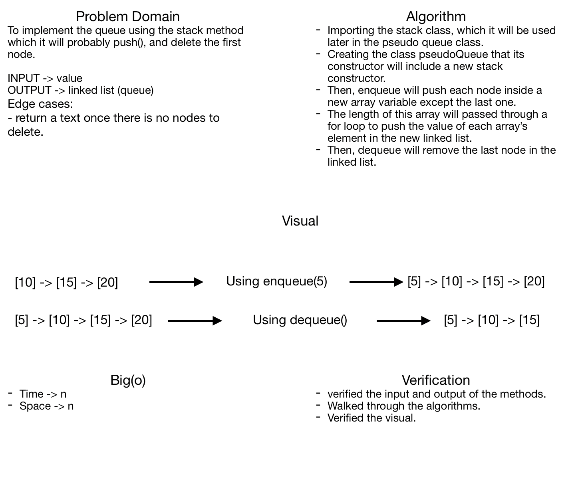

# Challenge Summary
**Queue with stack.**

## Challenge Description
**A way to implement queue with stacks' methods.**

## Approach & Efficiency
**Big(o) -> Time -> n**
**Big(o) -> Space -> n**

## Solution

