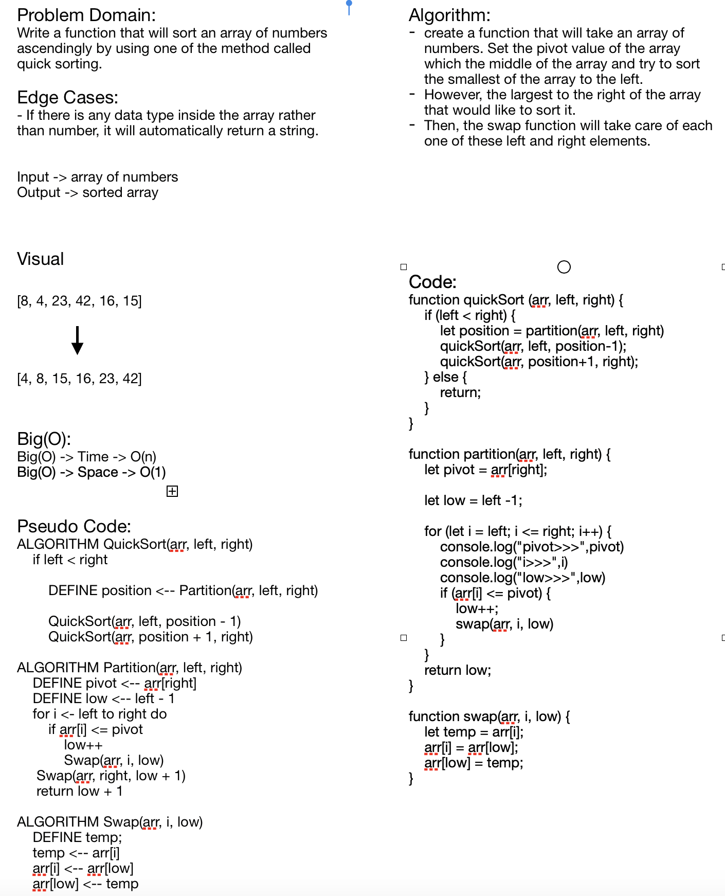

# Challenge Summary
**Quick Sort**

## Challenge Description
**Setting a pivot value as a reference element in the middle of the array. Then, looping through the array, each element will be swaped between the smallest and largest among them.**

## Approach & Efficiency
**Big(O) -> Time -> O(n)**
**Big(O) -> Space -> O(1)**

## Solution
