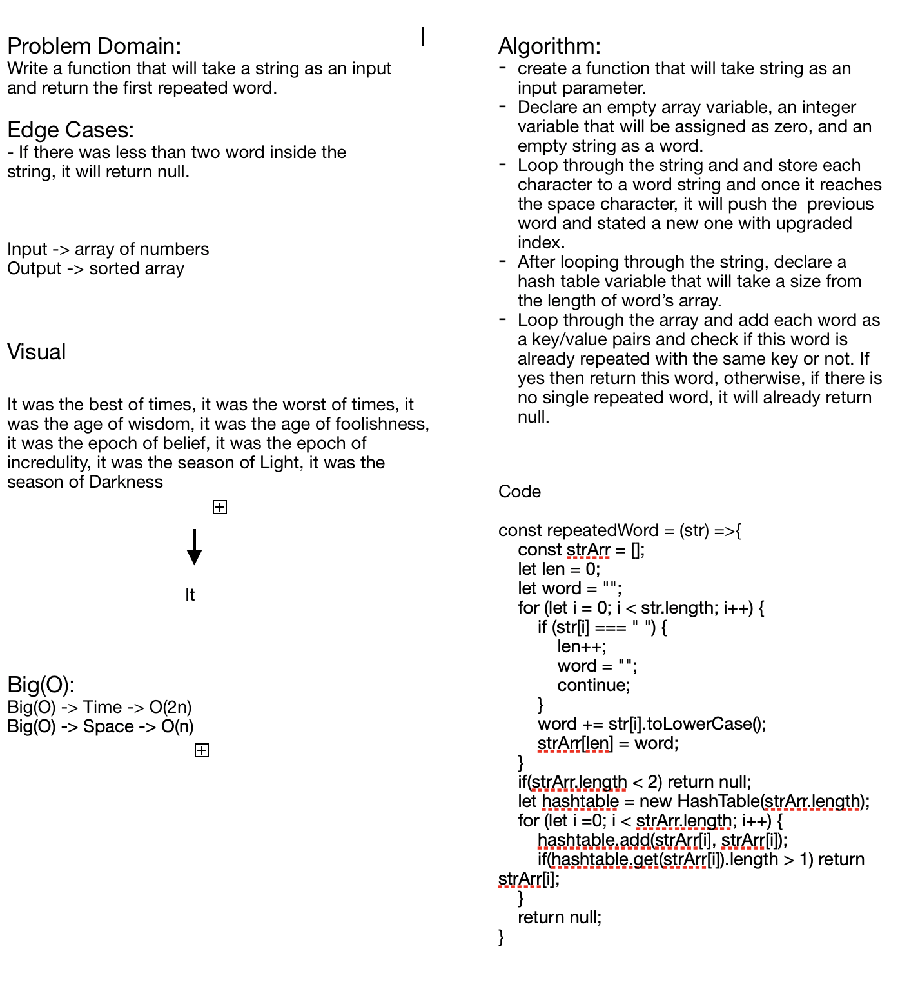

# Challenge Summary
**First Repeated Word**

## Challenge Description
**A function that will take a string and will separate the words in the string at an array, and by utilizing the hash table methods that will help us to check which the first repeated word in the string by their key.**

## Approach & Efficiency
**Big(O) -> Time -> o(2n)**
**Big(O) -> Space -> o(n)**

## Solution
