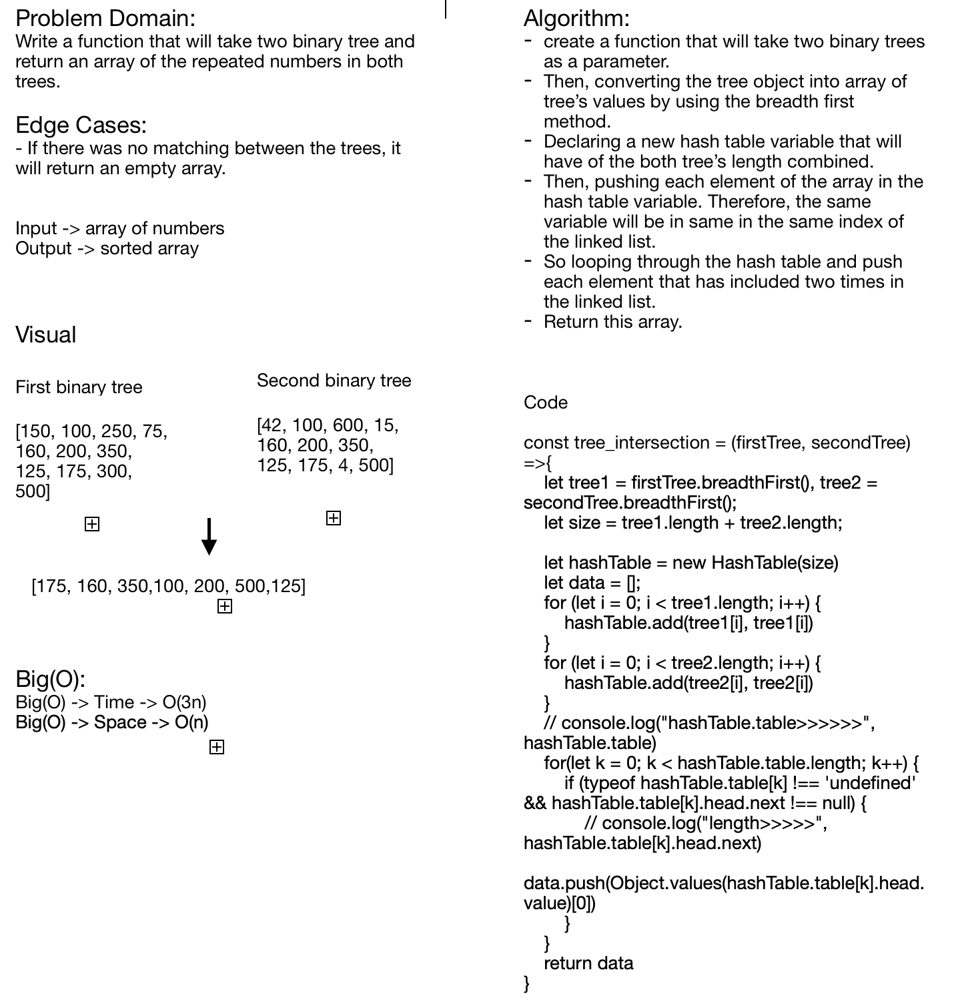

# Challenge Summary
**Tree Intersection**

## Challenge Description
**The idea of this code challenge is to pass two binary trees that we are going to check if there are any one of the binary tree's values are matching between them, then return an array of having the same value in the both trees.**

## Approach & Efficiency
**Big(O) -> Time -> O(3n)**
**Big(O) -> Space -> O(n)**

## Solution
